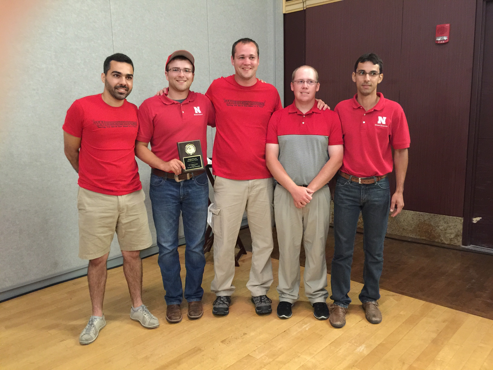
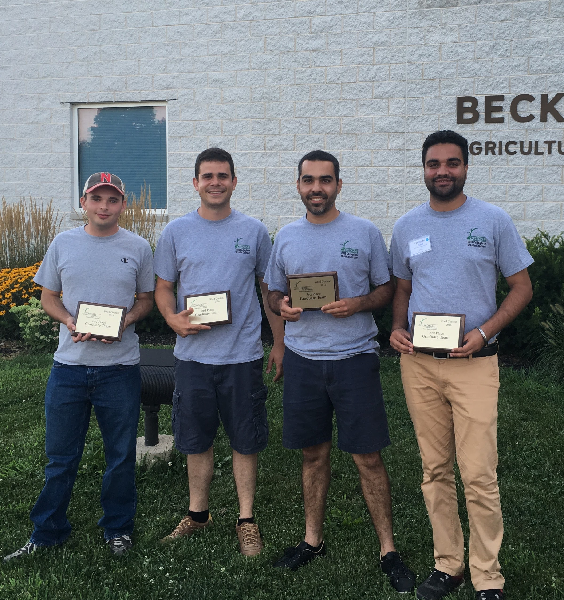
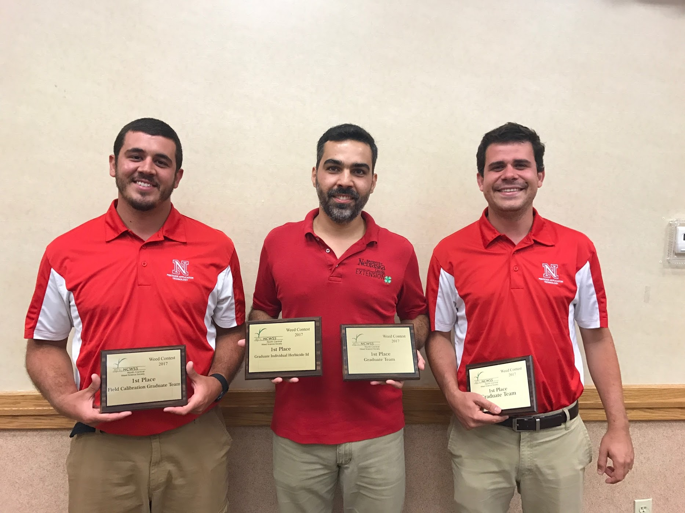
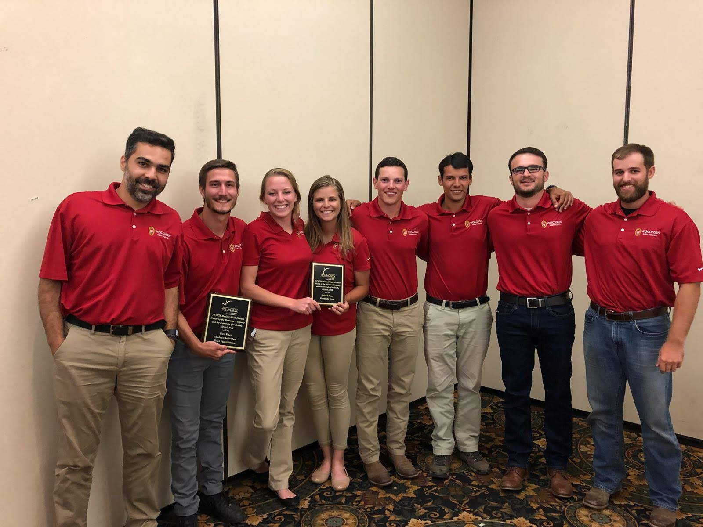

```{r include=FALSE}
library(tidyverse)
library(icons)
```

```{r setup, include=FALSE}
options(htmltools.dir.version = FALSE)
knitr::opts_chunk$set(
  fig.width=9, fig.height=3.5, fig.retina=3,
  out.width = "100%",
  cache = FALSE,
  echo = TRUE,
  message = FALSE, 
  warning = FALSE,
  fig.show = TRUE,
  hiline = TRUE
)
```

```{r xaringan-themer, include=FALSE, warning=FALSE}
library(xaringanthemer)
style_solarized_light()
```


```{r features, include=FALSE, warning=FALSE}
xaringanExtra::use_search(show_icon = TRUE,
                          position = "top-left")
xaringanExtra::use_webcam()
#xaringanExtra::use_freezeframe()
xaringanExtra::use_tile_view() # use letter O
xaringanExtra::use_share_again()
xaringanExtra::use_scribble() # use letter S
xaringanExtra::use_fit_screen()
xaringanExtra::use_broadcast() # use P
```

class: middle, center

## Maxwel Coura Oliveira


[`r icon_style(fontawesome("github"), style = "solid")` @maxwelco](https://github.com/maxwelco)  
[`r icon_style(fontawesome("twitter"), style = "solid")` @maxwelco](https://twitter.com/maxwelco)  
[`r icon_style(fontawesome("link"), style = "solid")` maxweeds.rbind.io](https://maxweeds.rbind.io)


---
background-image: url(images/juli.jpeg)
background-position: right
background-size: contain

## My experience


- Student

  - 2014
  
  - 2015
  
  - 2016
  
  - 2017
  
- Coach

  - 2018
  
  - 2019


---

## My experience

.pull-left[
<center>
- Ohio State 2015 (Weed Olympics)

</center>
]

.pull-right[

<center>
- Purdue 2016

</center>
]

---

## My experience

<center>
- Iowa State 2017 <br>

</center>

---

## My experience

<center>
- Nebraska 2018 <br>

</center>

---

class: inverse middle center

# Lessons


---
name: yourself

background-image: url(images/yourself.jpeg)
background-position: right
background-size: contain

## Lesson # 1


The outcome from the Weeds Contest will not define you


---
name: win

background-image: url(images/win.jpeg)
background-position: left
background-size: contain

.pull-right[
## Lesson # 2

Do not be scary to fail


]

---
name: fargo

background-image: url(https://upload.wikimedia.org/wikipedia/pt/4/45/FargoPoster.jpg)
background-position: right
background-size: contain

## Lesson # 3

... and **sometimes** you visited a new place for free


---
name: network

class: center
background-image: url(images/network.jpeg)
background-position: bottom
background-size: contain


## Lesson # 4

... and **always** increased your netwrok


---
name: outliers

background-image: url(https://slasherpastor.files.wordpress.com/2016/01/outliers-malcolm-gladwell.jpg)
background-position: right
background-size: contain

## Lesson # 5


"It takes 10,000 hours of practice to make you an expert<br> of anything"


---
name: velvetleaf

background-image: url(images/velvetleaf.jpeg)
background-position: left
background-size: contain

.pull-right[
## Lesson # 6

Look around you


Weeds are everywhere
]


---
name: sprayer

background-image: url(images/sprayer.jpeg)
background-position: right
background-size: contain

## Lesson # 7

Understand what are you doing at work

---

name: training

background-image: url(images/training.jpeg)
background-position: left
background-size: contain

.pull-right[
## Lesson # 8

Take courses

]

---
name: farmer

background-image: url(images/farmer.jpeg)
background-position: right
background-size: contain

## Lesson # 9

Talk to growers


---
name: reading

background-image: url(images/reading.jpeg)
background-position: left
background-size: contain

.pull-right[
## Lesson # 10

Read

]

---
class: middle, center

## Lesson # 11

Do not read only research papers

<br>

<center>

</center>

